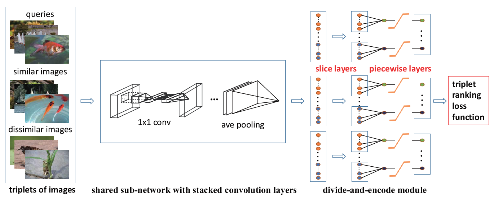
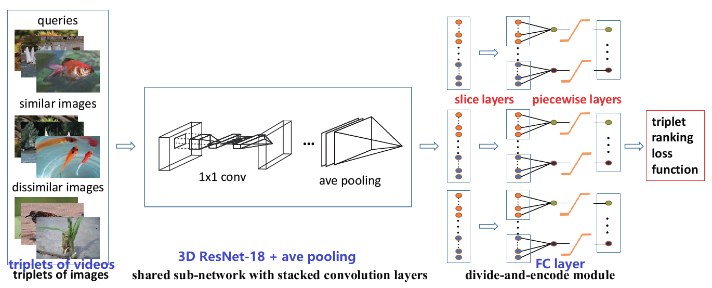

# Video Retrieval C3D

Pytorch implementation of a video retrieval model on datasets UCF101 and HMDB-51(Human Motion Data Base).

## Approach

### Network Structure

I mainly used the idea proposed in paper [*Simultaneous Feature Learning and Hash Coding with Deep Neural Networks*](https://www.cv-foundation.org/openaccess/content_cvpr_2015/html/Lai_Simultaneous_Feature_Learning_2015_CVPR_paper.html) for reference. And its network is proposed as fellow:



In order to adapt to the video retrieval task as well as enhance performance , I change the network structure  as fellow :



1. Model input should be triplets of videos rather than images. That is to say, I get all possilble triplets of videos in a batch as model input.
2. The shared CNN sub-network is replaced with a pre-trained 3D ResNet-18.
3. Divide-and-encode module is simplified as a fully connected layer. It projects the 512-dim extracted feature into a feature whose dimension can be 16, 32, 48, 64 and so on. I call this feature with lower dimension as approximate hash code. During training phase, it is a real number and is imported into the triplet ranking loss function to calculate loss for model optimization. And during inference phase, it is quantized as binary code for retrieval.

### what is hashing?

With the ever-growing large-scale video data on the Web, much attention has been devoted to nearest neighbor search via hashing methods. Learning-based hashing is an emerging stream of hash methods
that learn similarity-preserving hash functions to encode input data points (e.g., images,videos) into binary codes. A good hashing function is able to reduce the required memory and  improve the retrieval speed by a large margin.

### Triplet Loss

Triplet ranking loss is designed to characterize that one video is more similar to the second video than
to the third one.


F(I), F(I+) ,F(I-) denote the embeddings of the query video, similar video and dissimilar video respectively.


## Experiment

1. Train the network with triplet loss on the training set for 100 epochs.
2. Input the training set and testing set into the network to get embeddings and then turn the embeddings into binary hash codes with a simple quantization function.
3. Use testing sample as querie to retrieve videos from training samples. Calculate distance between binary codes of testing sample and training samples with Hamming distance. Use mAP to estimate the model's performance.

### Prerequisites

In order to run this code you will need to install:

1. Python3
2. Pytorch 0.4

### Usage

1. Firstly download and unzip the two datasets.
2. Use video2frames.py to turn each video into a set of frames.
3. Generate two files train.txt and test.txt, each line of which is in the format of [video_name,classid].
4. Change the datapath arguments  in train.py to indicate the file path.
5. Run the command bellow. 

```Bash
python train.py --dataset_name 'UCF' --hash_length 48 --margin 14  --num_frames 32 --lr 0.0001
```
And you can change the parameters if you want. I recommand to set margin as 20 when hash_length is 64 and 14 when binary_bits is 48. It is suggested to set the value of margin as  a bit bigger than a quarter of the value of binary_bits.

### Result

Common parameters：

| lr    | batch size | optimizer | num_epochs |
| ----- | ---------- | --------- | ---------- |
| 0.001 | 120        | SGD       | 160        |

#### UCF101

| binary bits | margin | num_frames | mAP    |
| ----------- | :----- | ---------- | ------ |
| 48          | 14     | 32         | 0.7004 |
| 64          | 20     | 32         | 0.7724 |

#### HMDB-51

| binary bits | margin | num_frames | mAP    |
| ----------- | :----- | ---------- | ------ |
| 48          | 8      | 32         | 0.4687 |
| 48          | 14     | 32         | 0.4763 |
| 48          | 14     | 16         |        |


### Reference

[1] Hanjiang Lai, Yan Pan, Ye Liu, Shuicheng Yan [*Simultaneous Feature Learning and Hash Coding with Deep Neural Networks*](https://www.cv-foundation.org/openaccess/content_cvpr_2015/html/Lai_Simultaneous_Feature_Learning_2015_CVPR_paper.html)

